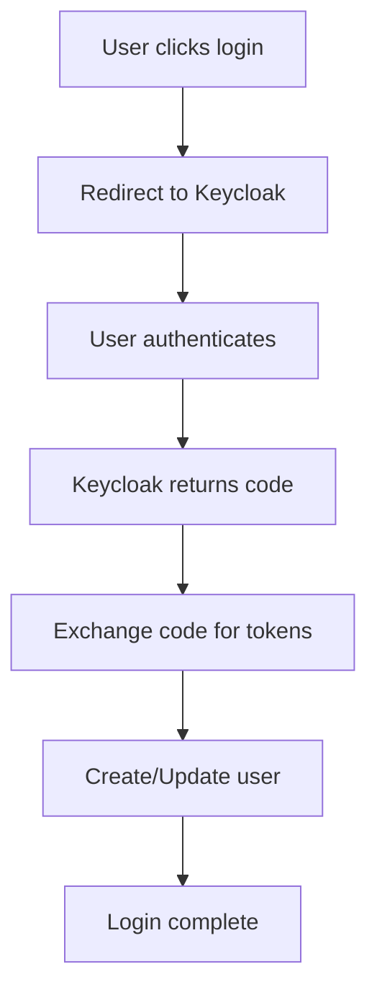
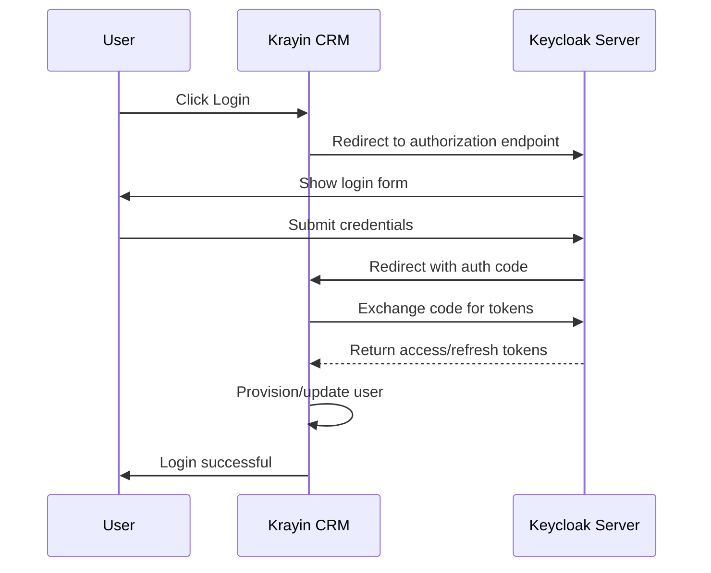
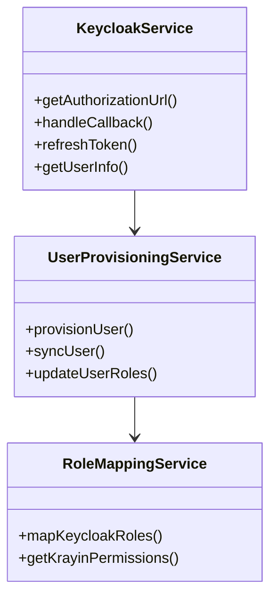
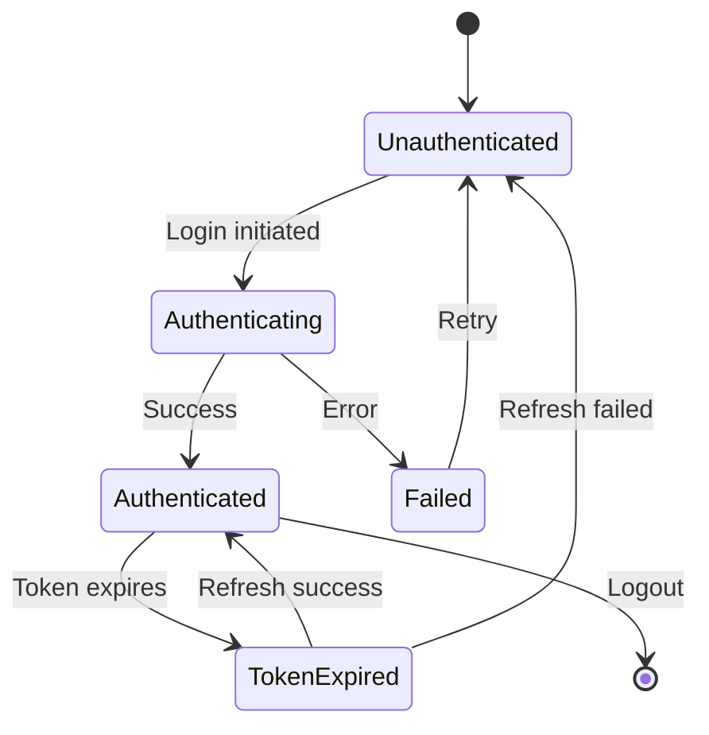
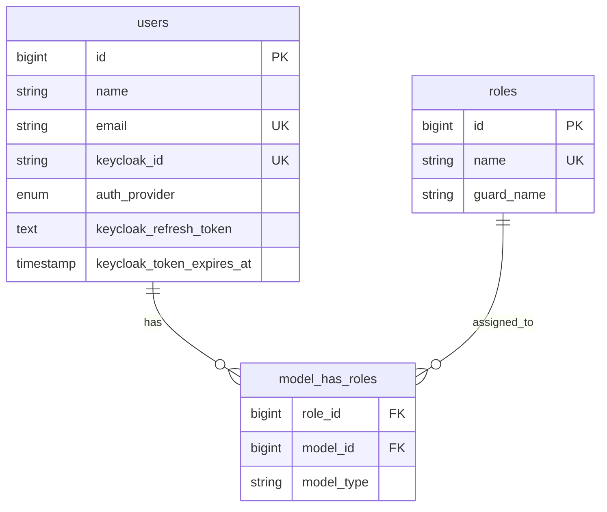
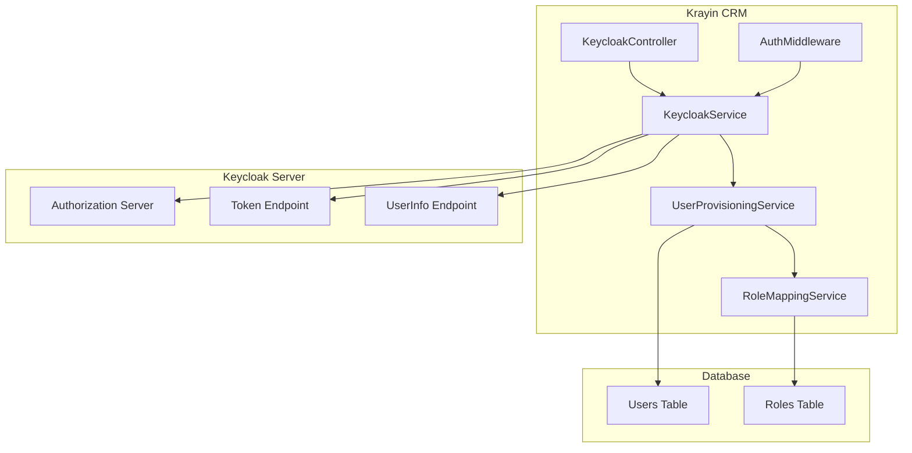
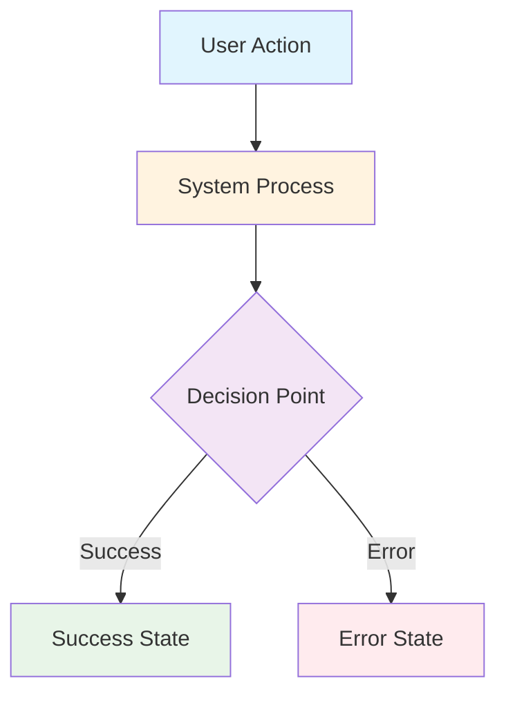

# Mermaid Diagram Guidelines for Wiki Documentation

## Overview
This document provides comprehensive guidelines for using Mermaid diagrams in Wiki documentation. GitHub Wiki supports Mermaid diagrams natively, enabling rich visual documentation.

## When to Use Mermaid Diagrams
Use Mermaid diagrams to enhance Wiki pages with visual representations in these scenarios:

- **Architecture Overviews**: System architecture, component relationships
- **Authentication Flows**: OAuth2/OpenID Connect flow diagrams
- **Data Flow**: How data moves through the system
- **Process Documentation**: Step-by-step workflows
- **Database Relationships**: Entity relationships and schema
- **Sequence Diagrams**: API interactions, user journeys
- **State Diagrams**: Authentication states, user provisioning states
- **Class Diagrams**: Service relationships, inheritance hierarchies

## Diagram Types and Use Cases

### 1. Flowcharts - Authentication Flow
Use for process flows, decision trees, and workflows.



**Use cases:**
- User authentication flows
- Error handling paths
- Configuration workflows
- Deployment processes

### 2. Sequence Diagrams - API Interactions
Use for showing interactions between components over time.



**Use cases:**
- OAuth2/OpenID Connect flows
- API request/response cycles
- Service-to-service communication
- User interaction journeys

### 3. Class Diagrams - Service Architecture
Use for showing object-oriented structure and relationships.



**Use cases:**
- Service layer architecture
- Class inheritance hierarchies
- Dependency relationships
- Interface implementations

### 4. State Diagrams - User States
Use for showing state transitions and lifecycle management.



**Use cases:**
- Authentication states
- User provisioning lifecycle
- Token management states
- Session management

### 5. Entity Relationship - Database Schema
Use for showing database structure and relationships.



**Use cases:**
- Database schema documentation
- Table relationships
- Migration planning
- Data model overview

### 6. System Architecture - Component Overview
Use for high-level system architecture and component interaction.



**Use cases:**
- System architecture overview
- Deployment architecture
- Integration points
- Infrastructure layout

## Color Conventions

Use consistent colors across all diagrams to aid understanding:



### Standard Color Palette
- **Blue** (`#e1f5fe`): User actions, external inputs
- **Orange** (`#fff3e0`): System processes, internal operations
- **Purple** (`#f3e5f5`): Decision points, conditional logic
- **Green** (`#e8f5e8`): Success states, positive outcomes
- **Red** (`#ffebee`): Error states, failures

## Implementation Guidelines

### Placement in Wiki Pages
- **Overview First**: Place architectural diagrams at the beginning of pages
- **Section Support**: Use inline diagrams to illustrate specific concepts
- **Complement Text**: Diagrams should enhance, not replace, written explanations
- **Progressive Detail**: Start with high-level, then provide detailed diagrams

### Diagram Standards
- **Consistent Styling**: Use the standard color palette across all diagrams
- **Clear Labels**: Use descriptive, concise labels (avoid abbreviations unless explained)
- **Logical Flow**: Ensure diagrams flow left-to-right or top-to-bottom
- **Appropriate Complexity**: Keep diagrams focused; split complex diagrams into multiple simpler ones
- **Readable Size**: Ensure text is readable; limit nodes to 15-20 per diagram

### Documentation Structure with Diagrams

Each Wiki page should follow this pattern when applicable:

```markdown
# Page Title

## Overview
[High-level system/process diagram]

Brief introduction text explaining the overview diagram.

## Section 1: Component Details
[Detailed diagram for this section]

Detailed explanation of the component.

### Implementation
Code examples and detailed instructions.

[Sequence diagram showing implementation flow]

## Section 2: Another Aspect
[Relevant diagram]

...

## Troubleshooting
[Flowchart for common issues]

Common problems and solutions.
```

### Example: Authentication Guide Structure

```markdown
# Keycloak Authentication Guide

## Overview
[System Architecture Diagram showing all components]

This guide explains how Keycloak authentication is integrated with Krayin CRM.

## Authentication Flow
[Sequence Diagram of OAuth2 flow]

The authentication process follows the OAuth2 Authorization Code flow...

## Implementation
### Service Configuration
[Class diagram showing service dependencies]

Configure the Keycloak services by...

### Database Schema
[Entity relationship diagram]

The authentication system uses these database tables...

## User Provisioning
[State diagram showing user lifecycle]

When a user authenticates for the first time...

## Troubleshooting
[Flowchart for common authentication issues]

If authentication fails, follow this diagnostic flowchart...
```

## Best Practices

### Version Control
- **Source in Markdown**: Keep diagram source in `.md` files for easy updates
- **Track Changes**: Update diagrams when code changes
- **Document Updates**: Note diagram updates in commit messages

### Accessibility
- **Alt Text**: Provide descriptive text before/after diagrams
- **Descriptions**: Explain what the diagram shows in accompanying text
- **Text Alternative**: Ensure information is accessible without diagrams

### Maintenance
- **Regular Reviews**: Review diagrams during code reviews
- **Update with Code**: Update diagrams when implementation changes
- **Consistency Checks**: Ensure diagrams match current implementation

### Testing
- **GitHub Rendering**: Verify Mermaid syntax renders correctly in GitHub Wiki
- **Multiple Browsers**: Test in different browsers if using complex features
- **Mobile View**: Check readability on mobile devices

### Documentation
- **Complex Logic**: Document any complex diagram logic in accompanying text
- **Legend**: Provide legend for color coding if not using standard palette
- **Links**: Link related diagrams together

## Tools for Diagram Development

### Online Editors
- **Mermaid Live Editor**: https://mermaid.live - Test and develop diagrams with live preview
- **Mermaid Chart**: https://www.mermaidchart.com - Advanced diagramming with collaboration

### VS Code Extensions
- **Markdown Preview Mermaid Support**: Real-time preview in VS Code
- **Mermaid Editor**: Dedicated Mermaid diagram editor

### GitHub Integration
- **GitHub Wiki**: Edit Wiki pages directly with live preview
- **Pull Request Previews**: Review diagrams in PR previews before merging

### Documentation Resources
- **Official Mermaid Docs**: https://mermaid.js.org - Complete syntax reference
- **GitHub Mermaid Support**: https://github.blog/2022-02-14-include-diagrams-markdown-files-mermaid/

## Quick Reference

### Common Mermaid Syntax

#### Flowchart
```
flowchart TD
    A[Square] --> B{Diamond}
    B -->|Yes| C[Result 1]
    B -->|No| D[Result 2]
```

#### Sequence
```
sequenceDiagram
    Alice->>Bob: Hello
    Bob-->>Alice: Hi back
```

#### Class
```
classDiagram
    Class1 <|-- Class2
    Class1 : +method()
```

#### State
```
stateDiagram-v2
    [*] --> State1
    State1 --> [*]
```

#### ER Diagram
```
erDiagram
    CUSTOMER ||--o{ ORDER : places
```

#### Graph
```
graph LR
    A[Start] --> B[Process]
    B --> C[End]
```

## Examples Repository

For more examples, refer to:
- **Wiki Pages**: See existing Wiki documentation for live examples
- **Test Diagrams**: `.kennis/examples/mermaid-examples.md` (if available)
- **Architecture Docs**: `.kennis/architecture/` folder for complex diagrams
