# Architecture Documentation

Technical architecture and design documentation for Keycloak SSO Extension.

## Table of Contents

- [Overview](#overview)
- [System Architecture](#system-architecture)
- [Component Diagrams](#component-diagrams)
- [Sequence Diagrams](#sequence-diagrams)
- [Database Schema](#database-schema)
- [Security Architecture](#security-architecture)
- [Design Patterns](#design-patterns)

## Overview

The Keycloak SSO Extension integrates Krayin CRM with Keycloak identity provider using OAuth 2.0 / OpenID Connect protocol. The architecture follows Laravel best practices and implements a service-oriented design.

### Key Architectural Principles

1. **Separation of Concerns**: Services, controllers, and middleware have distinct responsibilities
2. **Dependency Injection**: All dependencies injected through constructors
3. **Event-Driven**: Authentication events for extensibility
4. **Error Handling**: Centralized error handling with fallback support
5. **Security First**: Encrypted tokens, CSRF protection, secure sessions

## System Architecture

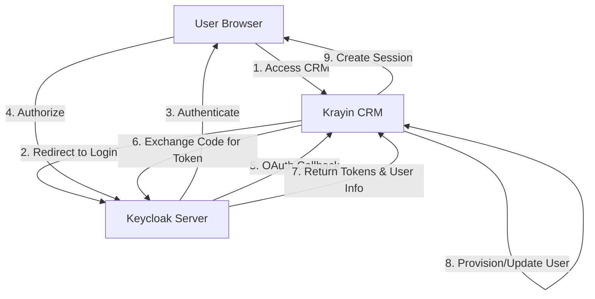

## Component Diagrams

### High-Level Components

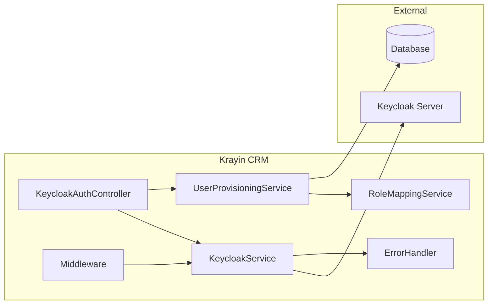

### Service Layer Architecture

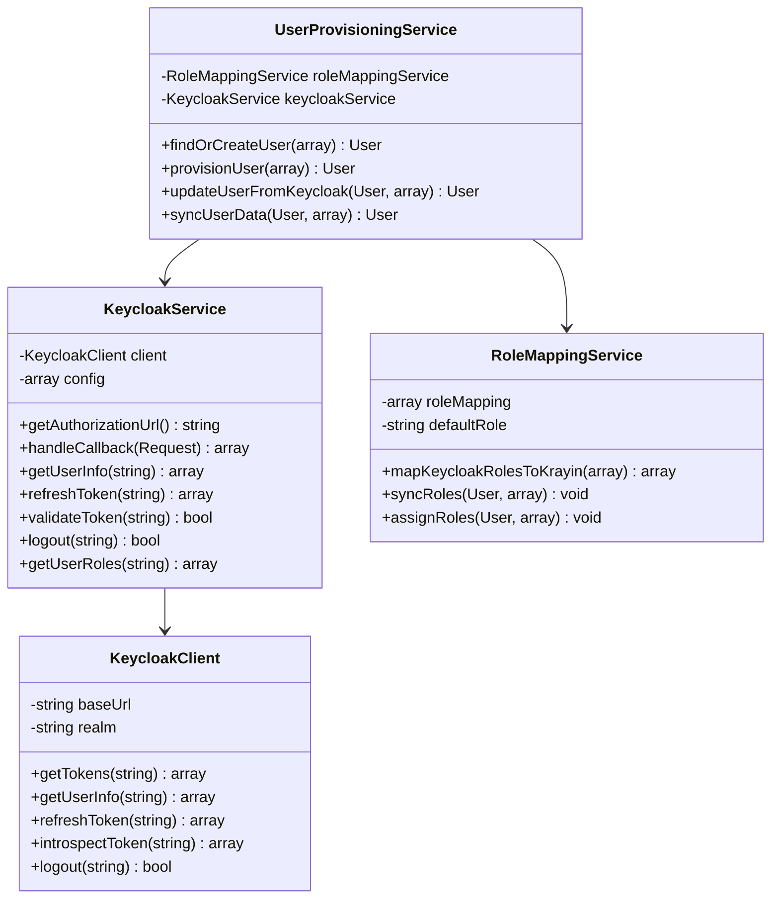

## Sequence Diagrams

### Complete Authentication Flow

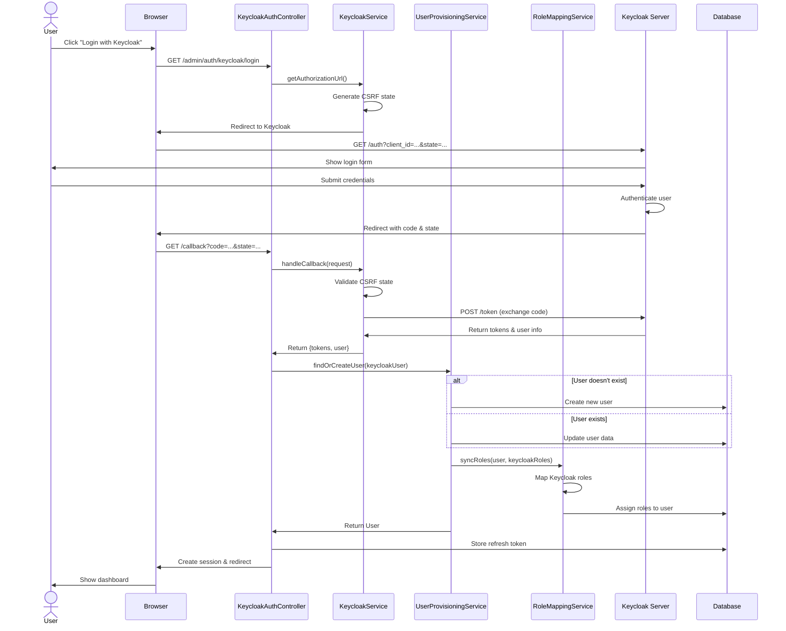

### Token Refresh Flow

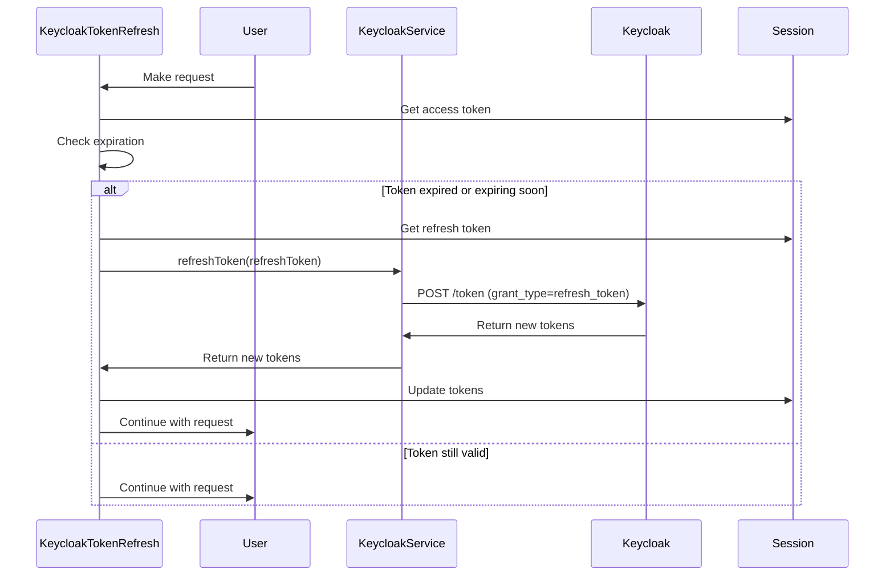

### Logout Flow (Single Logout)

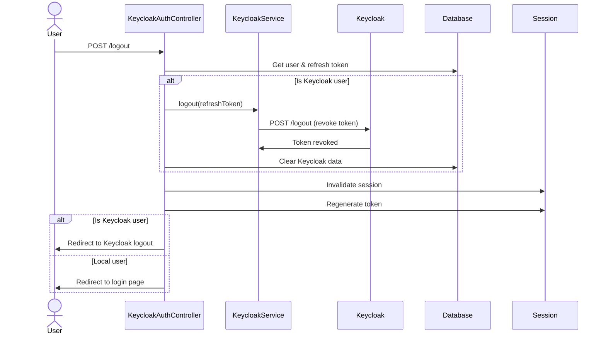

### User Provisioning Decision Flow

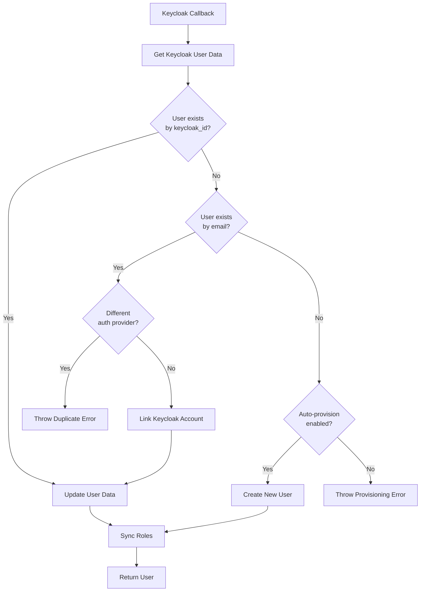

## Database Schema

### Users Table Extensions

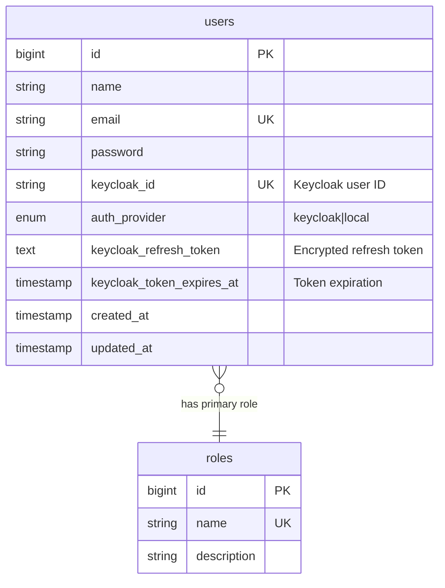

### Indexes

```sql
-- Primary keycloak_id lookup
CREATE INDEX idx_users_keycloak_id ON users(keycloak_id);

-- Auth provider filtering
CREATE INDEX idx_users_auth_provider ON users(auth_provider);

-- Combined lookup optimization
CREATE INDEX idx_users_provider_keycloak ON users(auth_provider, keycloak_id);
```

## Security Architecture

### Token Security

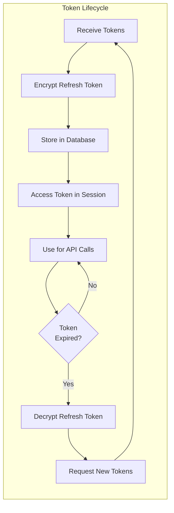

### CSRF Protection

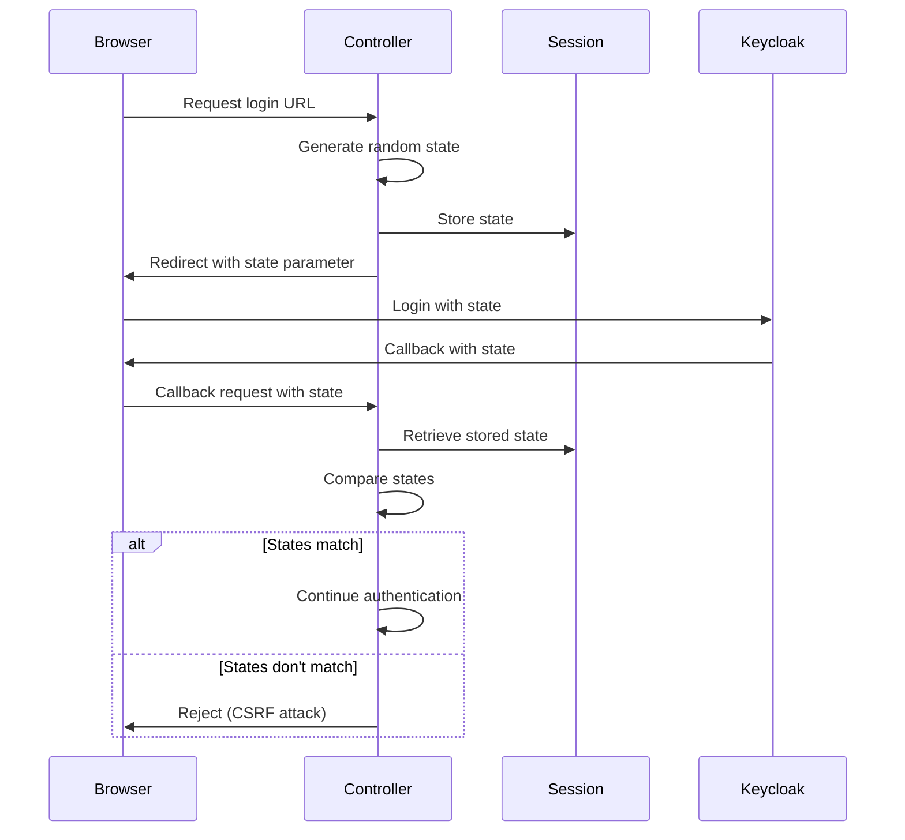

### Security Layers

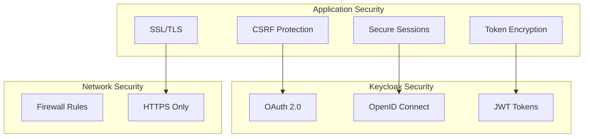

## Design Patterns

### Service Layer Pattern

```php
// Services encapsulate business logic
class KeycloakService {
    public function handleCallback(Request $request): array {
        // Business logic for OAuth callback
    }
}

// Controllers orchestrate services
class KeycloakAuthController {
    public function callback(Request $request) {
        $data = $this->keycloakService->handleCallback($request);
        $user = $this->provisioningService->findOrCreateUser($data['user']);
        Auth::login($user);
    }
}
```

### Repository Pattern (Implicit)

```php
// Eloquent models act as repositories
class User extends Model {
    public static function findByKeycloakId(string $id): ?User {
        return static::where('keycloak_id', $id)->first();
    }
}
```

### Strategy Pattern (Role Mapping)

```php
// Different role mapping strategies
interface RoleMappingStrategy {
    public function map(array $keycloakRoles): array;
}

class OneToOneMapping implements RoleMappingStrategy {
    public function map(array $keycloakRoles): array {
        // Simple one-to-one mapping
    }
}

class ComplexMapping implements RoleMappingStrategy {
    public function map(array $keycloakRoles): array {
        // Complex multi-role mapping
    }
}
```

### Observer Pattern (Events)

```php
// Fire events for extensibility
event(new KeycloakLoginSuccessful($user, $keycloakUser));

// Listeners observe events
class SyncKeycloakUser implements ShouldQueue {
    public function handle(KeycloakLoginSuccessful $event) {
        // Sync user data
    }
}
```

### Facade Pattern

```php
// Simplified interface to complex subsystem
class Keycloak {
    public static function login(): RedirectResponse {
        return app(KeycloakService::class)->redirect();
    }

    public static function logout(): RedirectResponse {
        return app(KeycloakAuthController::class)->logout();
    }
}
```

## Error Handling Architecture

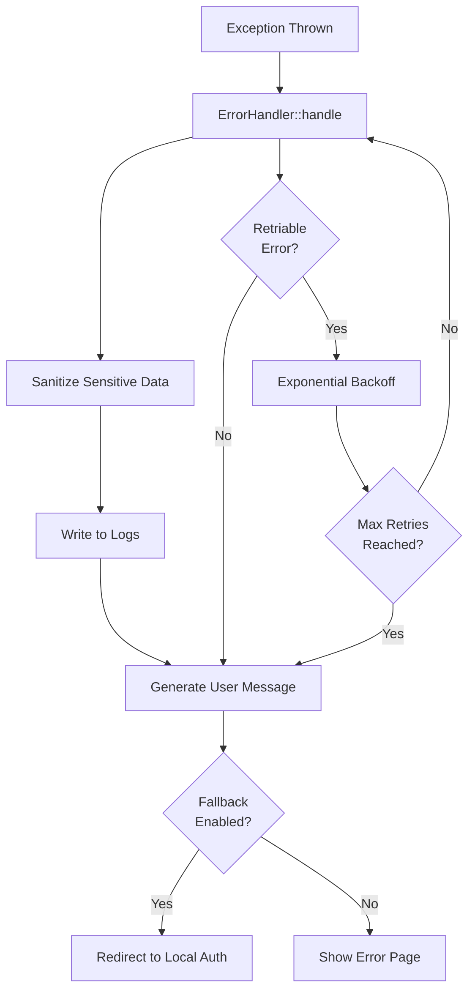

## Performance Considerations

### Caching Strategy

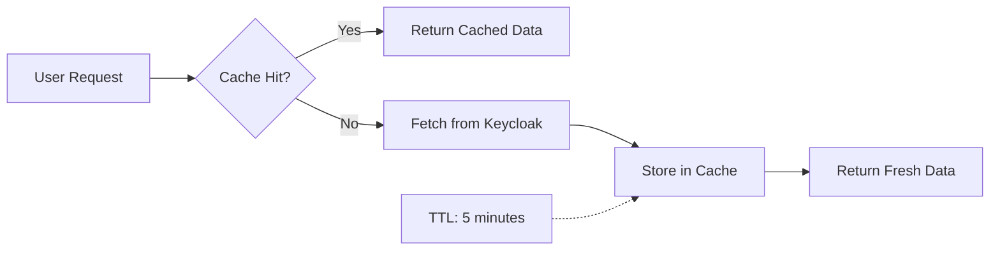

### Database Optimization

- **Indexes**: Optimized for Keycloak lookups
- **Eager Loading**: Prevent N+1 queries
- **Transactions**: Ensure data consistency

## Extensibility Points

### Custom Event Listeners

```php
// Listen to authentication events
Event::listen(KeycloakLoginSuccessful::class, function ($event) {
    // Custom logic after successful login
});
```

### Custom Role Mapping

```php
// Override role mapping logic
$service = app(RoleMappingService::class);
$service->setRoleMapping([
    'custom-role' => 'Custom Krayin Role',
]);
```

### Middleware Customization

```php
// Add custom middleware to Keycloak routes
Route::middleware(['web', 'custom.middleware'])->group(function () {
    Route::get('/keycloak/login', [KeycloakAuthController::class, 'redirect']);
});
```

## Technology Stack

- **Framework**: Laravel 10+
- **PHP**: 8.2+
- **Database**: MySQL/PostgreSQL
- **Authentication**: OAuth 2.0 / OpenID Connect
- **Security**: Laravel Encryption, HTTPS
- **Cache**: Laravel Cache (Redis/Memcached)
- **Testing**: PHPUnit
- **Documentation**: Markdown, Mermaid diagrams

## Best Practices Implemented

1. **SOLID Principles**: Single responsibility, dependency injection
2. **12-Factor App**: Configuration via environment variables
3. **Security by Design**: Defense in depth, fail securely
4. **Clean Code**: PSR-12 standards, meaningful names
5. **Documentation**: Inline PHPDoc, architecture diagrams
6. **Testing**: Unit, feature, and integration tests
7. **Error Handling**: Graceful degradation, user-friendly messages
8. **Performance**: Caching, query optimization, lazy loading
