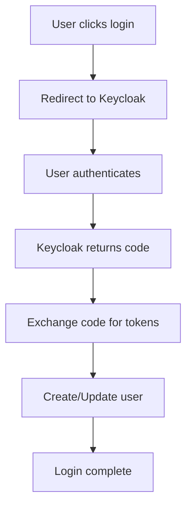
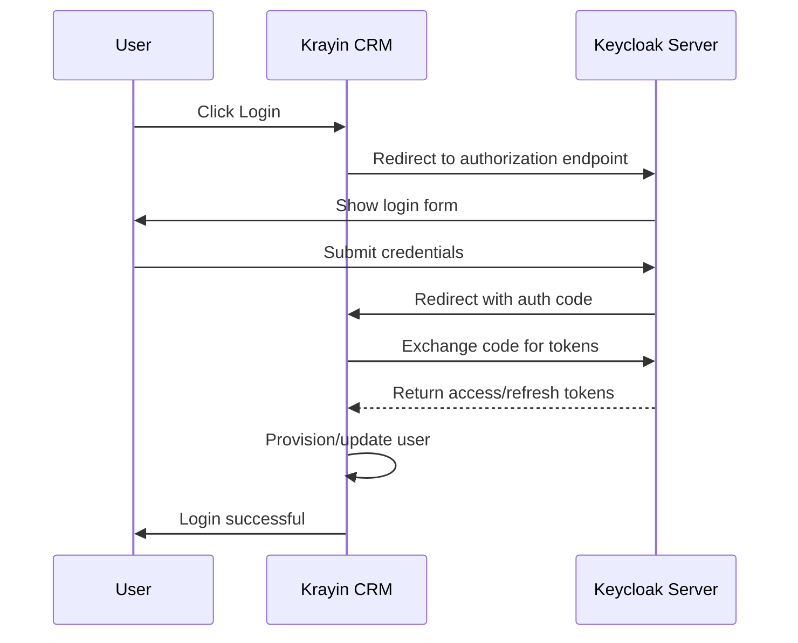
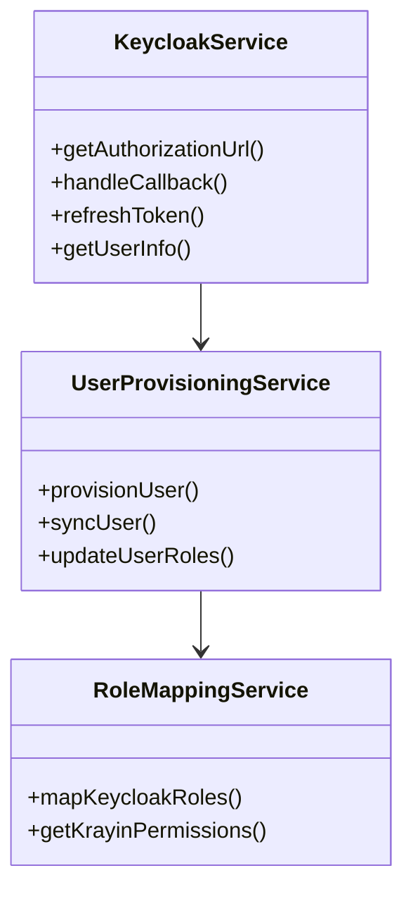
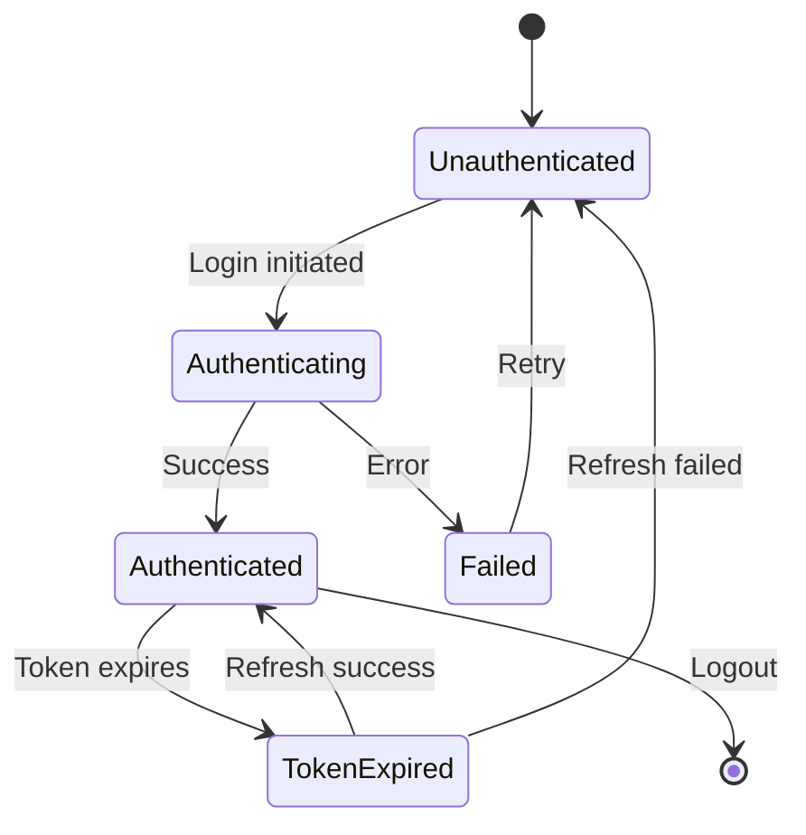
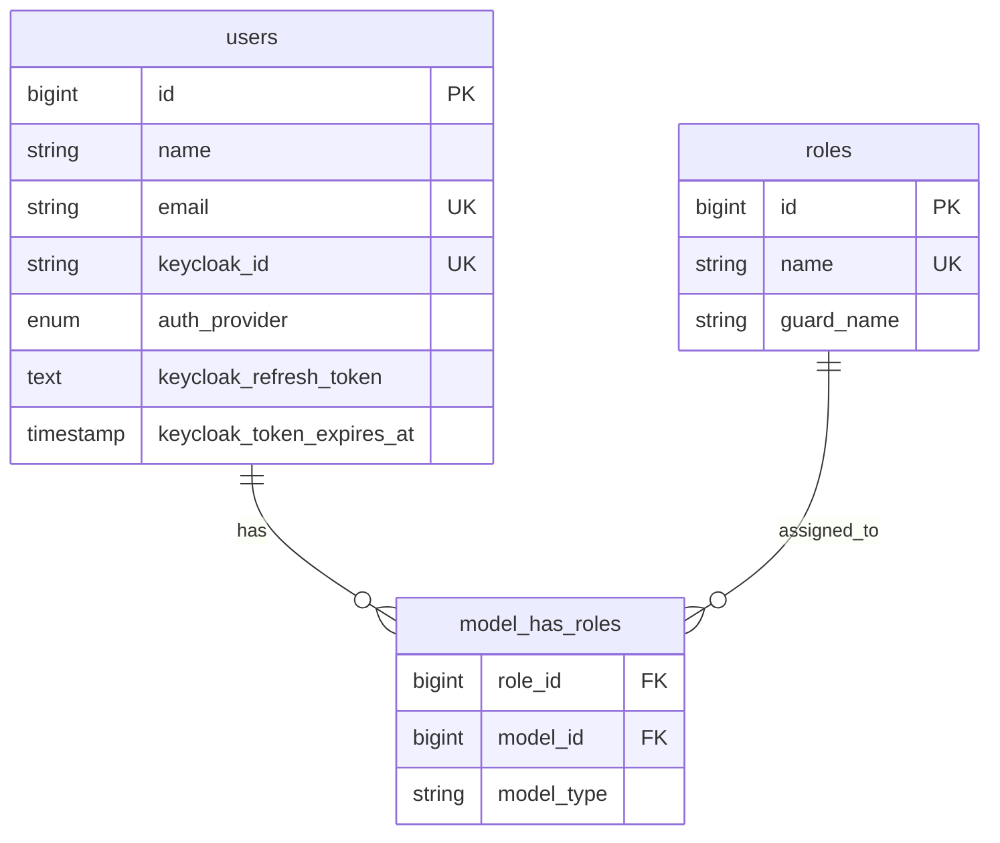
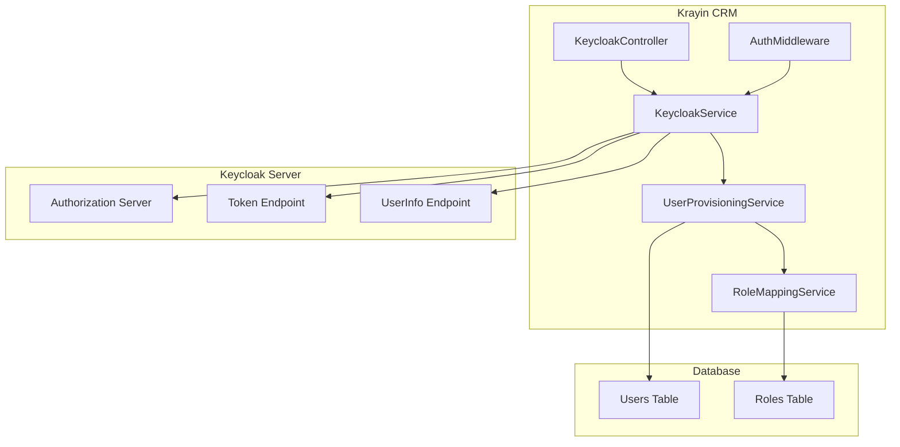
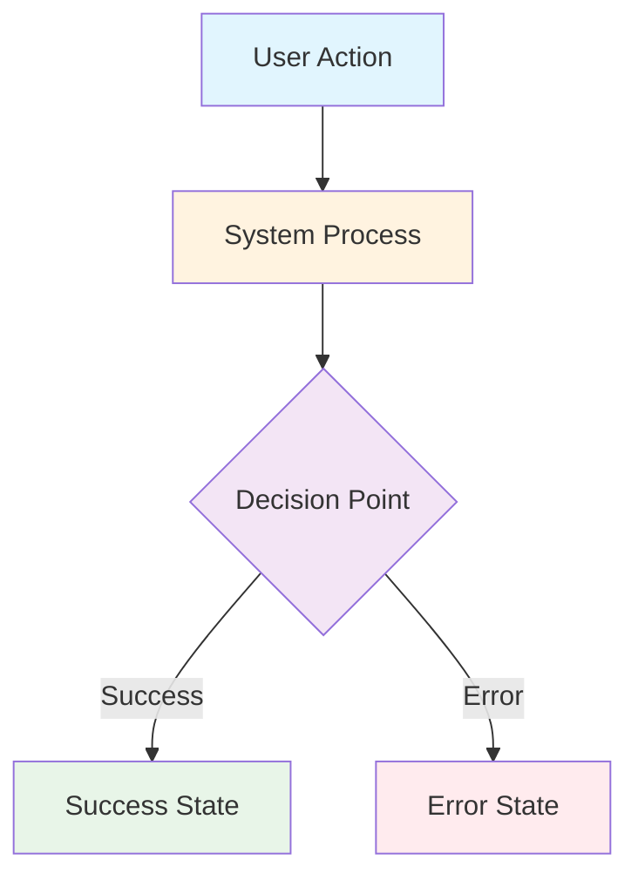

# Claude Code Instructions - Krayin CRM Keycloak SSO Extension

## Documentation Access
- You can use the MCP Server deepwiki to get the latest documentation

## Quick Reference Guide

This file serves as the main entry point for development guidelines. For detailed information, refer to the specialized documentation files:

### Core Documentation Files

1. **[Internationalization Guidelines](.kennis/INTERNATIONALIZATION.md)**
   - Supported languages (en, pt_BR)
   - Translation conventions and best practices
   - What to translate and what not to translate
   - Testing translations

2. **[Git Workflow & Documentation](.kennis/GIT_WORKFLOW.md)**
   - GitFlow best practices
   - Branch naming conventions
   - Commit message standards
   - Documentation structure (.kennis vs Wiki)
   - Version control and semantic versioning

3. **[CHANGELOG Management](.kennis/CHANGELOG_MANAGEMENT.md)**
   - When and how to update CHANGELOG.md
   - Format standards (Keep a Changelog)
   - Templates for different change types
   - Release process

4. **[GitHub Issue Management](.kennis/GITHUB_ISSUE_MANAGEMENT.md)**
   - Issue tracking system
   - Automatic bug/error issue creation
   - Issue templates and labels
   - Workflow for working with issues

5. **[Mermaid Diagram Guidelines](.kennis/MERMAID_GUIDELINES.md)**
   - When and how to use Mermaid diagrams in Wiki
   - Diagram types and examples
   - Color conventions and standards
   - Best practices for visual documentation

## Internationalization (i18n)

> **📖 Detailed Guide**: See [INTERNATIONALIZATION.md](.kennis/INTERNATIONALIZATION.md) for comprehensive i18n guidelines.

### Quick Summary
All implementations must support multiple languages:
- **English (en)**: Primary language, always required
- **Brazilian Portuguese (pt_BR)**: Secondary language, always required

### Key Points
- All user-facing content must be translated
- Use descriptive translation keys with dot notation
- Keep technical content (code, configs, etc.) in English
- Test both languages during development

**Example:**
```php
// In controllers
return redirect()->back()->with('success', __('keycloak::auth.login_success'));

// In views
<h1>{{ __('keycloak::auth.login_title') }}</h1>
```

## Git Workflow

> **📖 Detailed Guide**: See [GIT_WORKFLOW.md](.kennis/GIT_WORKFLOW.md) for complete git workflow documentation.

### Quick Summary
Follow GitFlow best practices with specific branch types for each implementation.

### Branch Naming Convention
- **Feature branches**: `feature/<issue-number>-<feature-name>`
- **Fix branches**: `fix/<issue-number>-<issue-description>`
- **Hotfix branches**: `hotfix/<critical-fix>`
- **Release branches**: `release/<version>`

### Main Branches
- **main**: Production-ready code
- **develop**: Integration branch for features

### Development Workflow
1. Create feature/fix branch from `develop`
2. Implement changes with frequent commits
3. Update documentation (.kennis and/or Wiki)
4. Create pull request to `develop`
5. After testing, merge `develop` to `main` for release

## Documentation Structure

> **📖 Related**: See [GIT_WORKFLOW.md](.kennis/GIT_WORKFLOW.md) for detailed documentation guidelines.

### Documentation Locations
- **Technical/Implementation**: `.kennis/` folder
  - Architecture decisions
  - Implementation plans
  - Internal development guides
  
- **User-Facing**: GitHub Wiki (`/Users/possebon/workspaces/kennis/krayin-crm/keycloak.wiki`)
  - Installation guides
  - User documentation
  - API reference
  - Troubleshooting

### Mermaid Diagrams

> **📖 Detailed Guide**: See [MERMAID_GUIDELINES.md](.kennis/MERMAID_GUIDELINES.md) for comprehensive diagram guidelines.

**Use Mermaid diagrams in Wiki documentation whenever possible** to visually enhance:
- Architecture overviews
- Authentication flows (OAuth2/OIDC)
- Data flow and processes
- Database relationships
- Sequence diagrams for API interactions
- State diagrams for user/token lifecycle

See the Mermaid Guidelines document for examples, color conventions, and best practices.

## Version Control
- Follow semantic versioning (MAJOR.MINOR.PATCH)
- Update version in `composer.json` and relevant config files
- Tag releases in git

## Git Workflow
- We want to work with the best practices of gitflow and we need to create specific branches for each type of implementation: feature, fix, etc. Always consider this before implementing something on codebase.

## Branch Naming Convention
- **Feature branches**: `feature/<feature-name>` (e.g., `feature/keycloak-authentication`)
- **Fix branches**: `fix/<issue-description>` (e.g., `fix/token-refresh-bug`)
- **Hotfix branches**: `hotfix/<critical-fix>` (e.g., `hotfix/security-patch`)
- **Release branches**: `release/<version>` (e.g., `release/1.0.0`)

## Main Branches
- **main**: Production-ready code
- **develop**: Integration branch for features

## Documentation Structure
- **Implementation plans**: Should be created at `.kennis` folder
- **User guides**: Should be created on Wiki as GitHub Wiki pages
- **Development guides**: Should be created on Wiki as GitHub Wiki pages
- **Wiki location**: `/Users/possebon/workspaces/kennis/krayin-crm/keycloak.wiki`

## Development Workflow
1. Always create a feature/fix branch from `develop`
2. Implement changes in the feature branch
3. Update documentation in `.kennis` for technical implementation details
4. Update Wiki for user-facing documentation
5. Create pull request to merge back to `develop`
6. After testing, merge `develop` to `main` for release

## Documentation Guidelines
- Technical architecture and implementation details → `.kennis/` folder
- API documentation and usage examples → Wiki
- User guides and installation instructions → Wiki
- Change logs and version history → Wiki

### Mermaid Diagrams in Wiki Documentation
Whenever possible and applicable, use Mermaid diagrams to enhance Wiki documentation with visual representations. GitHub Wiki supports Mermaid diagrams natively.

#### When to Use Mermaid Diagrams
- **Architecture Overviews**: System architecture, component relationships
- **Authentication Flows**: OAuth2/OpenID Connect flow diagrams
- **Data Flow**: How data moves through the system
- **Process Documentation**: Step-by-step workflows
- **Database Relationships**: Entity relationships and schema
- **Sequence Diagrams**: API interactions, user journeys
- **State Diagrams**: Authentication states, user provisioning states
- **Class Diagrams**: Service relationships, inheritance hierarchies

#### Diagram Types and Use Cases

##### 1. Flowcharts - Authentication Flow


##### 2. Sequence Diagrams - API Interactions


##### 3. Class Diagrams - Service Architecture


##### 4. State Diagrams - User States


##### 5. Entity Relationship - Database Schema


##### 6. System Architecture - Component Overview


#### Implementation Guidelines

##### Placement in Wiki Pages
- Place diagrams at the beginning of sections for overview
- Use inline diagrams to illustrate specific concepts
- Add diagrams to complement, not replace, textual explanations

##### Diagram Standards
- **Consistent Styling**: Use consistent colors and shapes across all diagrams
- **Clear Labels**: Use descriptive, concise labels
- **Logical Flow**: Ensure diagrams flow left-to-right or top-to-bottom
- **Appropriate Complexity**: Keep diagrams focused and not overly complex

##### Color Conventions


- **Blue** (`#e1f5fe`): User actions, external inputs
- **Orange** (`#fff3e0`): System processes, internal operations
- **Purple** (`#f3e5f5`): Decision points, conditional logic
- **Green** (`#e8f5e8`): Success states, positive outcomes
- **Red** (`#ffebee`): Error states, failures

##### Documentation Structure with Diagrams
Each Wiki page should follow this pattern when applicable:

1. **Overview Diagram**: High-level system/process overview
2. **Detailed Sections**: Each with relevant detailed diagrams
3. **Implementation Examples**: Code samples with sequence diagrams
4. **Troubleshooting**: Flow charts for common issues

##### Example: Authentication Guide Structure
```
# Keycloak Authentication Guide

## Overview
[System Architecture Diagram]

## Authentication Flow
[Sequence Diagram of OAuth2 flow]

## Implementation
### Service Configuration
[Class diagram showing dependencies]

### Database Schema
[Entity relationship diagram]

## Troubleshooting
[Flowchart for common authentication issues]
```

#### Best Practices
- **Version Control**: Include diagram source in `.md` files for easy updates
- **Accessibility**: Always provide alt text or descriptions for diagrams
- **Maintenance**: Update diagrams when code changes
- **Testing**: Verify Mermaid syntax renders correctly in GitHub
- **Documentation**: Document complex diagram logic in accompanying text

#### Tools for Diagram Development
- **GitHub Web Interface**: Edit Wiki pages directly with live preview
- **VS Code Extensions**: Mermaid preview extensions for development
- **Mermaid Live Editor**: https://mermaid.live for testing complex diagrams
- **Documentation**: Official Mermaid docs at https://mermaid.js.org

## Version Control
- Follow semantic versioning (MAJOR.MINOR.PATCH)
- Update version in `composer.json` and relevant config files
- Tag releases in git

## CHANGELOG.md Management

> **📖 Detailed Guide**: See [CHANGELOG_MANAGEMENT.md](.kennis/CHANGELOG_MANAGEMENT.md) for comprehensive CHANGELOG guidelines.

### Quick Summary
The CHANGELOG.md file must be updated with every significant change following the [Keep a Changelog](https://keepachangelog.com/en/1.0.0/) format.

### When to Update
- ✅ Completing a phase
- ✅ Fixing bugs
- ✅ Adding features
- ✅ Making breaking changes
- ✅ Releasing versions
- ✅ Security updates

### Standard Sections
- **Added**: New features
- **Changed**: Changes to existing functionality
- **Fixed**: Bug fixes
- **Security**: Security vulnerability fixes
- **Deprecated**: Soon-to-be removed features
- **Removed**: Removed features

### Quick Example
```markdown
## [Unreleased]

### Added
- **Phase 4**: Keycloak Service Integration (#4)
  - Implemented OAuth2/OpenID Connect flows
  - Added token management methods
  - Created unit tests with 85% coverage

### Fixed
- Fixed token refresh timeout error (#15)
```

See the detailed guide for templates, examples, and best practices.

## GitHub Issue Management

> **📖 Detailed Guide**: See [GITHUB_ISSUE_MANAGEMENT.md](.kennis/GITHUB_ISSUE_MANAGEMENT.md) for comprehensive issue management guidelines.

### Quick Summary
This project uses GitHub Issues for comprehensive task and bug tracking with 14 milestones (one per implementation phase) and structured labels.

### Working with Issues

#### Standard Workflow
1. Check open issues and assign yourself
2. Create feature branch: `feature/<issue-number>-<description>`
3. Reference issue in commits: `git commit -m "feat: implement feature (#2)"`
4. Create PR with `Closes #<issue-number>`

#### Automatic Bug Creation
**IMPORTANT**: Automatically create GitHub issues when encountering:
- Build/compilation errors
- Test failures
- Runtime errors
- Security vulnerabilities
- Performance issues

### Quick Bug Issue Template
```bash
gh issue create \
  --title "Bug: <concise description>" \
  --body "<see detailed guide for full template>" \
  --label "bug,priority-high" \
  --assignee @me
```

### Issue Labels
- **Phase**: `phase-1` through `phase-14`
- **Type**: `enhancement`, `bug`, `documentation`, `testing`, `security`
- **Priority**: `priority-high`, `priority-medium`, `priority-low`

### Useful Commands
```bash
# View milestone issues
gh issue list --milestone "Phase 4: Keycloak Service"

# View your issues
gh issue list --assignee @me

# View high priority bugs
gh issue list --label "bug,priority-high"
```

See the detailed guide for templates, examples, and best practices.
